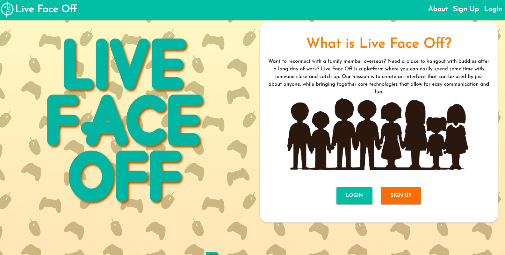
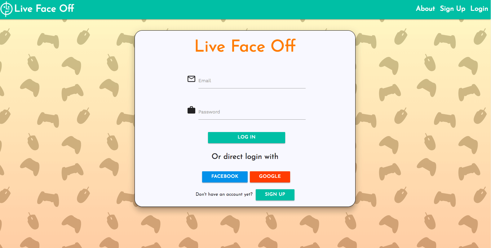
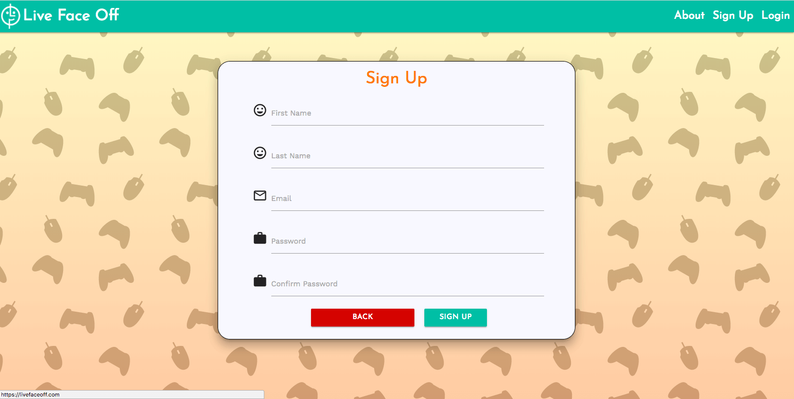
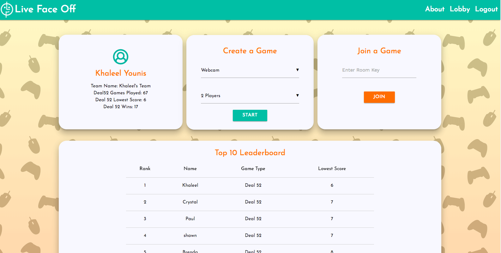

### Live Face Off

Connect with your friends and family and enjoy some time with each other.

## Getting Started

To start playing simply navigate to our website @livefaceoff.com, and create an account with one our three methods (Google, Facebook, or our own login system). Once you have an account, you will be on our lobby page where you can see your user stats as well as the top 10 leaderboard. From there, you can choose to create a game where you will receive a room code that you can share, or join one with a code given to you. We currently have to game modes (Deal 52 and a web cam based game) with more in development. If you don't feel like showing your camera, you can use the built in chat system. Please enjoy your time, and happy gaming!

 | 
:-------------------------:|:-------------------------:

 | 
:-------------------------:|:-------------------------:

## Technologies Used

# Frontend

ReactJS, 
Redux, 
Materialize CSS, 
Axios, 
Socket.io-client, 
TokBox Web Cam API (WebRTC Technology) 

# Backend

Node.js, 
MongoDB (mlab), 
Mongoose, 
Express, 
Passport.js (Google / Facebook / Local), 
Socket.io, 
Jwt, 
TokBox Web Cam API (WebRTC Technology)

## Tools Used

* Git
* GitHub
* MeisterTask

## To run the app locally

Clone the git repository then navigate to the server folder in your command line. Run the command "npm install", then navigate to the client folder and run the command "npm install". After those are done, run the command "npm run dev" to start both the front and backend up.

## Authors

* Khaleel Younis [GitHub](https://github.com/stallenvp)
* Shawn Levin [GitHub](https://github.com/slevin22)
* Paul Lee [GitHub](https://github.com/Fedrius)
* Crystal Navarro[GitHub](https://github.com/xoxocrystyle)

* Visit it my website! [Portfolio](https://khaleelyounis.com/)

